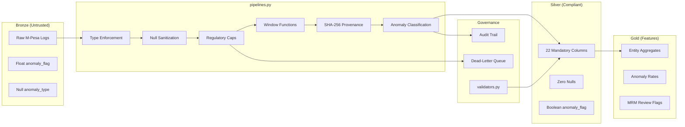

# SentinAI

Autonomous, agentic AI platform for enterprise financial compliance.

## Overview

SentinAI is a comprehensive financial compliance platform that implements a Medallion architecture (Bronze-Silver-Gold) for data processing with built-in auditability, lineage tracking, and differential privacy. It serves as an autonomous, audit-ready multi-agent framework for financial compliance and operational forecasting, integrating RAG-based grounding with SHAP-explainable predictive models to ensure transparent, compliant, and data-driven business process automation.

## Architecture

- **Bronze Layer**: Raw data ingestion from PostgreSQL and S3 sources
- **Silver Layer**: Data cleaning, entity resolution, and quality validation
- **Gold Layer**: Feature engineering and feature store creation

## Key Features

- OpenLineage integration for complete audit trails
- Differential privacy for synthetic data generation
- Great Expectations for data quality validation
- Entity resolution using Jaro-Winkler similarity
- M-Pesa transaction pattern simulation
- Agentic RAG system for Kenyan financial crime compliance
- Hybrid search with BM25 and cross-encoder reranking
- Comprehensive evaluation metrics (Precision@k, MRR, Citation Fidelity)

## Installation

```bash
poetry install
```

## Usage

Run the medallion orchestrator (Bronze → Silver → Gold with AML engine, anomaly injection, and OpenLineage):

```bash
poetry run python scripts/run_audit_and_synth.py --fast-mode
```

Individual stages (thin CLI wrappers over `src/data/medallion_stages.py`):

```bash
poetry run python scripts/run_bronze.py --fast-mode
poetry run python scripts/run_silver.py
poetry run python scripts/run_gold.py
```


## Compliance

This platform follows MRM (Model Risk Management) compliance standards with immutable audit trails and version-controlled data transformations. It prioritizes Kenyan statutory law (POCAMLA, DPA 2019) as absolute authority for financial crime compliance decisions.

### AML Transformation Pipeline (Bronze → Silver → Gold)

The POCAMLA-compliant transformation engine lives in `src/data/pipelines.py` and enforces strict typing, regulatory wallet caps, velocity checks, SHA-256 provenance hashing, and stateful entity lifecycle tracking.

```python
import polars as pl
from src.data.pipelines import run_medallion_pipeline

bronze = pl.read_parquet("data/bronze/transactions/2026-07-07/*.parquet")
result = run_medallion_pipeline(bronze)

result["silver"].write_parquet("data/silver/compliant_transactions.parquet")
result["gold"].write_parquet("data/gold/behavioral_features.parquet")
```

#### Data Flow



#### Regulatory Thresholds

Configured in `config/regulatory.yaml` (not hardcoded):

| KYC Tier | Balance Cap (KES) | Daily Velocity Cap (KES) |
| :--- | ---: | ---: |
| TIER_1 | 50,000 | 100,000 |
| TIER_2 | 500,000 | 1,000,000 |
| VENDOR_MERCHANT | 5,000,000 | 10,000,000 |

#### MRM Compliance Matrix

| Column | POCAMLA Requirement | MRM Control |
| :--- | :--- | :--- |
| `entity_id` | Customer identification | Primary key integrity, zero nulls |
| `kyc_tier_level` | Tiered wallet limits | Enum validation against `regulatory.yaml` |
| `transaction_amount` | Transaction reporting threshold | Positive amount enforcement |
| `account_balance_after` | Wallet cap compliance | Capped at tier-specific maximum |
| `anomaly_flag` | Suspicious activity detection | Strict Boolean typing (no float) |
| `anomaly_type` | Explainable violation reason | Deterministic classification enum |
| `data_provenance_hash` | Data integrity (DPA 2019) | SHA-256 over canonical raw payload |
| `regulatory_report_status` | FIU escalation workflow | Maps severity to reporting tier |
| `account_first_seen` / `account_last_seen` | Customer lifecycle | Stateful `over("entity_id")` windows |
| `is_wallet_balance_compliant` | Balance validation | Per-tier cap comparison |
| `ingestion_timestamp` | Audit trail | System clock at transformation time |

#### Transformation Logic

1. **Normalize** — Map Bronze column aliases (`customer_id` → `entity_id`, `kyc_tier` → `kyc_tier_level`).
2. **Type enforce** — Cast `anomaly_flag` from float/null to strict Boolean; coerce timestamps to UTC.
3. **Sanitize nulls** — `fill_null()` with explicit defaults from `regulatory.yaml` (never silent).
4. **Regulatory caps** — `account_balance_after = min(raw_balance, tier_cap)`; flag violations.
5. **Stateful windows** — `first_value` / `last_value` over `entity_id` for tenure tracking.
6. **Anomaly detection** — Classify `VELOCITY_SURGE`, `AMOUNT_SPIKE`, `SMURFING`, `ROUND_NUMBER_CHURN`, `REGULATORY_CEILING_VIOLATION`.
7. **Provenance** — SHA-256 hash of canonical JSON payload per row.
8. **Validate** — `validators.py` schema and constraint checks; violations logged to audit trail.

#### Running Tests

```bash
poetry run pytest tests/test_pipelines.py -v
```
