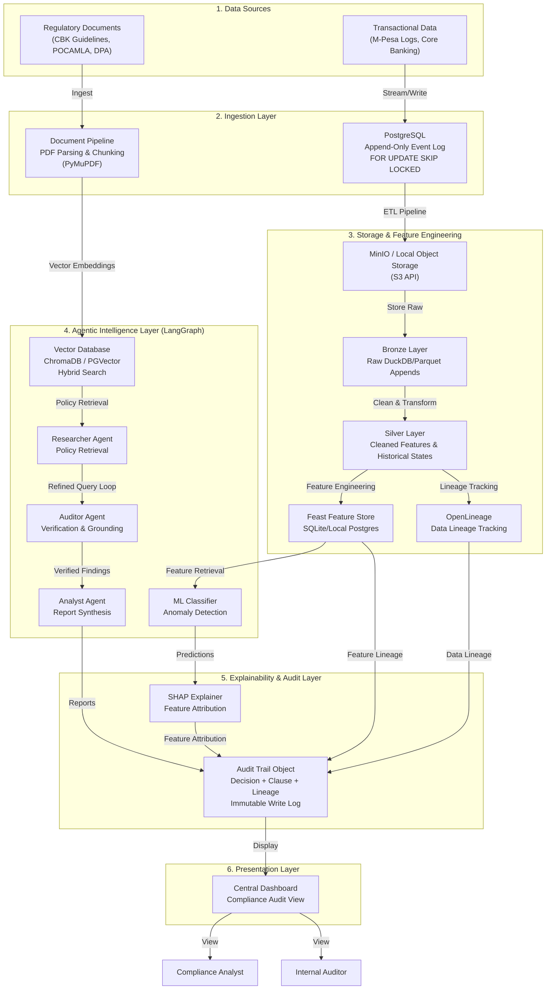

# SentinAI Architecture Diagram

```mermaid
graph TB
    subgraph "1. Data Sources"
        TX["Transactional Data<br/>(M-Pesa Logs, Core Banking)"]
        REG["Regulatory Documents<br/>(CBK Guidelines, POCAMLA, DPA)"]
    end

    subgraph "2. Ingestion Layer"
        PG["PostgreSQL<br/>Append-Only Event Log<br/>FOR UPDATE SKIP LOCKED"]
        DOCPIPE["Document Pipeline<br/>PDF Parsing &amp; Chunking<br/>(PyMuPDF)"]
    end

    subgraph "3. Storage &amp; Feature Engineering"
        MINIO["MinIO / Local Object Storage<br/>(S3 API)"]
        BRONZE["Bronze Layer<br/>Raw DuckDB/Parquet Appends"]
        SILVER["Silver Layer<br/>Cleaned Features &amp; Historical States"]
        FEAST["Feast Feature Store<br/>SQLite/Local Postgres"]
        LINEAGE["OpenLineage<br/>Data Lineage Tracking"]
    end

    subgraph "4. Agentic Intelligence Layer (LangGraph)"
        VECTOR["Vector Database<br/>ChromaDB / PGVector<br/>Hybrid Search"]
        RESEARCHER["Researcher Agent<br/>Policy Retrieval"]
        AUDITOR["Auditor Agent<br/>Verification &amp; Grounding"]
        ANALYST["Analyst Agent<br/>Report Synthesis"]
        CLASSIFIER["ML Classifier<br/>Anomaly Detection"]
    end

    subgraph "5. Explainability &amp; Audit Layer"
        SHAP["SHAP Explainer<br/>Feature Attribution"]
        AUDIT_TRAIL["Audit Trail Object<br/>Decision + Clause + Lineage<br/>Immutable Write Log"]
    end

    subgraph "6. Presentation Layer"
        DASHBOARD["Central Dashboard<br/>Compliance Audit View"]
    end

    ANALYST_USER["Compliance Analyst"]
    AUDITOR_USER["Internal Auditor"]

    TX -->|Stream/Write| PG
    REG -->|Ingest| DOCPIPE
    PG -->|ETL Pipeline| MINIO
    DOCPIPE -->|Vector Embeddings| VECTOR
    MINIO -->|Store Raw| BRONZE
    BRONZE -->|Clean &amp; Transform| SILVER
    SILVER -->|Feature Engineering| FEAST
    SILVER -->|Lineage Tracking| LINEAGE
    FEAST -->|Feature Retrieval| CLASSIFIER
    VECTOR -->|Policy Retrieval| RESEARCHER
    RESEARCHER -->|Refined Query Loop| AUDITOR
    AUDITOR -->|Verified Findings| ANALYST
    CLASSIFIER -->|Predictions| SHAP
    ANALYST -->|Reports| AUDIT_TRAIL
    SHAP -->|Feature Attribution| AUDIT_TRAIL
    FEAST -->|Feature Lineage| AUDIT_TRAIL
    LINEAGE -->|Data Lineage| AUDIT_TRAIL
    AUDIT_TRAIL -->|Display| DASHBOARD
    DASHBOARD -->|View| ANALYST_USER
    DASHBOARD -->|View| AUDITOR_USER
```